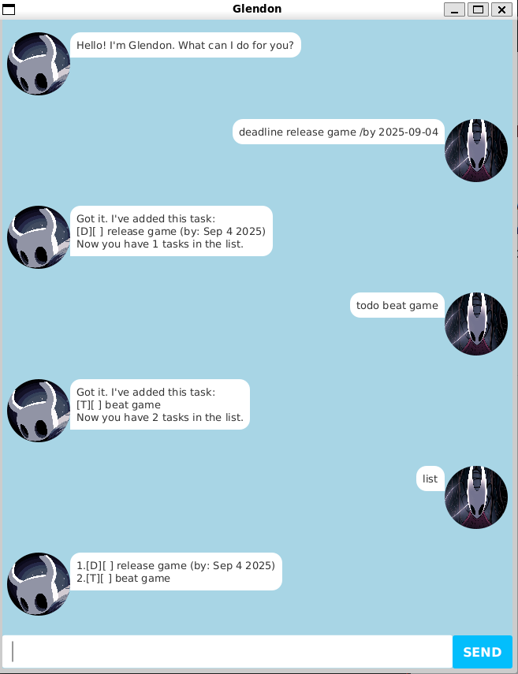

# Glendon User Guide

Blazingly fast CLI-based task manager chatbot for those who thrive in the terminal.

# Quick Start
1. Ensure you have Java 17 installed in your computer.
2. Download the latest `.jar` file from [here](https://github.com/Glenn-Chiang/ip/releases/tag/A-Release).
3. Navigate into the directory containing the `.jar` file.
4. Run `java -jar glendon.jar` to start the application.

# Features

## Adding tasks
The user can add 3 types of tasks to the task list: Todos, Deadlines and Events.

### Todo
Command: `todo <description>`.  
The description can contain multiple words.

Examples:  
- `todo workout`
- `todo play hollow knight silksong`

### Deadline
Command: `deadline <description> /by <date>`  
Date format: `yyyy-MM-dd`

Examples:
- `deadline 2103t ip /by 2025-09-19`
- `deadline ST2334 quiz /by 2025-09-18`

### Event
Command: `event <description> /from <start-time> /to <end-time>`  
Datetime format: `yyyy-MM-dd HHmm`

Examples:
- `event cca session /from 2025-09-17 1500 /to 2025-09-17 1630`
- `event recess week /from 2025-09-20 0000 /to 2025-09-28 2359`

## Listing tasks: `list`
Displays all tasks in the task list.  

Command: `list`

## Finding tasks: `find`
Finds tasks whose description contains any of the given keywords and displays all matching tasks.  

Command: `find <keywords>`

Examples: 
- `find play`
- `find hollow knight`
- `find silksong`
- `find silk`
- `find song`
- `find hollow knight silksong`
- All the above inputs should display the task with description "play hollow knight silksong"

## Marking/unmarking tasks: `mark`/`unmark`
Mark/unmark a specified task as completed/not completed, using its displayed index.  

Command: `mark <index>`

Examples: 
- `mark 1`
- `unmark 2`

## Deleting tasks: `delete`
Delete a specified task using its displayed index.

Command: `delete <index>`

Example: `delete 2`

## Saving data
Glendon automatically saves the task list to `data/tasks.txt` whenever changes are made. 

## Exiting the app
Command: `bye`